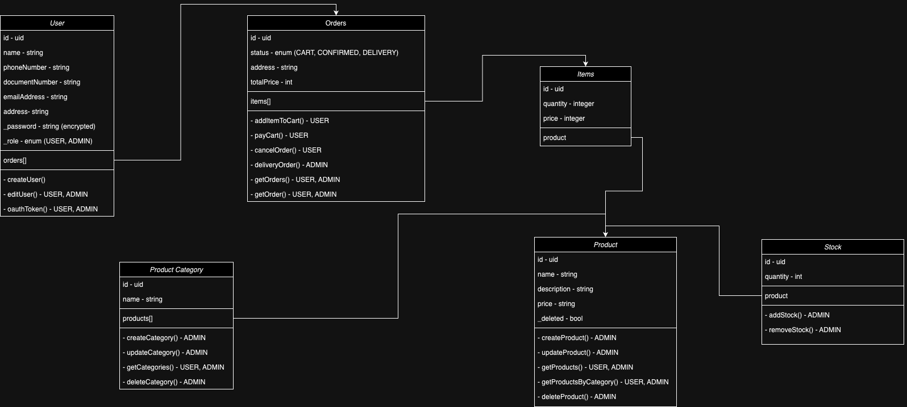

# r2-take-home-project

## Project Architecture

This project follows a modular and organized architecture, facilitating maintenance and scalability. Below is an explanation of each directory and its responsibilities.

## Directory Structure

src/
├── data/
├── domain/
├── infra/
├── main/
└── presentation/

### 1. `data`

The `data` directory is responsible for implementing the interfaces defined in the `domain` layer and for implementing the data access methods, facilitating communication between the controller and the database.

#### Responsibilities:
- Implements interfaces to be used by the adapters in `infra`.
- Contains the data access methods (dbMethods).

### 2. `domain`

The `domain` layer contains the interfaces implemented by the `data` layer, as well as data models (models) that are used throughout the project.

#### Responsibilities:
- Defines the interfaces that are implemented by the `data` layer.
- Contains the models (models) used in some layers of the project.

### 3. `infra`

The `infra` directory contains the adapters that encapsulate the external libraries used in the project, such as database drivers, authentication, and other frameworks. This layer connects the application with external technologies in a decoupled manner.

#### Responsibilities:
- Implements adapters for external libraries and frameworks.
- Contains integration with infrastructure, such as Redis, authentication, etc.
- Abstracts the complexity of external libraries and provides a simplified interface for the upper layers.

### 4. `main`

The `main` directory is responsible for configuring and instantiating the application components, including factories, middlewares, schemas, and routes. It connects all parts of the system and configures the application's execution flow.

#### Responsibilities:
- Configures middlewares and schema validations.
- Configures routes and instantiates components.
- Defines the main entry point of the application and organizes the execution flow.

### 5. `presentation`

The `presentation` layer contains the controllers responsible for processing requests and interacting with the `infra` and `data` layers. It directly handles the interaction with the user or external systems, manipulating inputs and outputs, and executing the business logic.

#### Responsibilities:
- Contains controllers responsible for interacting with clients, executing business logic.
- Defines helpers that assist in processing input and output data.
- Organizes the logic of presenting data to the client.

## Execution Flow

1. **Receiving the request**: When a request arrives, it is main where it validade schema, configure routes.
2. **Processing business logic**: The controller calls methods from the `data` and `infra` directories, helping implement the business logic.
3. **Data access**: If necessary, the `controller` interacts with the `data` layer to access or persist data in the database.
4. **Response to the client**: Finally, the response is formatted by the controller and returned to the client.

## How to Run

To run the project locally, follow these steps:

1. Use correct version of Node:
   ```bash
    nvm use
   ```
2. Generate prisma models
   ```bash
    npx prisma generate
   ```

2. Run locally
   ```bash
    npm start
   ```

## CI/CD

This project uses GitHub Actions for Continuous Integration and Continuous Deployment (CI/CD). Every time code is pushed to the `master` branch, the following pipeline is triggered:

1. **Run Tests:** A GitHub Actions workflow pipeline is executed to run the project's tests.
2. **Deployment:** If all tests pass successfully, a URL is called to pull the latest changes and deploy the container (defined on Dockerfile).

This ensures that the application is automatically tested and deployed on every change pushed to the `master` branch, maintaining a continuous flow from development to production.

## Definition of classes



## Postman Collection

You can access the project's Postman collection using the following link:

[View Postman Collection](https://universal-station-318821.postman.co/workspace/Code2~0f456f8a-7eef-447b-83d0-baba313d8d66/collection/23743628-8341ab6f-da2b-4402-8ebf-2f9ec93c8803?action=share&creator=23743628)

## API Documentation

You can access the Swagger API documentation at the following URL:

  ```bash
    /api-docs
  ```

## Monitoring

You can access the Prometheus monitoring at the following URL:

  ```bash
    /metrics
  ```